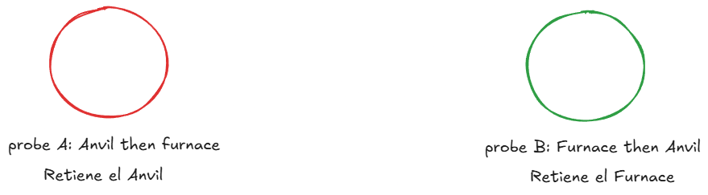
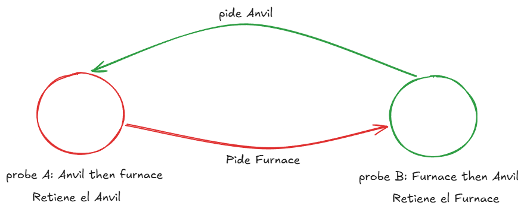
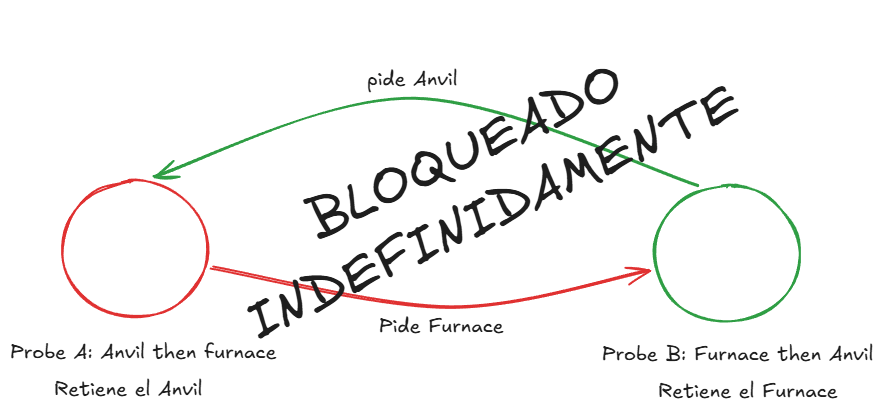

# ARSW Lab 3 - Relic Rush - Delivery Report

## Team

| Student | ID | GitHub |
|---|---|---|
|Cristian Ronaldo Guerrero Buitrago |1000101455 |Cove1946 |
|Juan Esteban Tellez Valencia | 1000098939 |JuanTellez125 |
|Andrea Mariana Parra Urrego  |1000101817 |marianaparraurrego-oss |

Repository: `URL`

Final commit: `SHA`

## 1. Baseline observations

- Command(s) executed:


```text
java -cp target/classes edu.eci.arsw.relicrush.app.RelicRushMain
```

```text
java -cp target/classes edu.eci.arsw.relicrush.app.LedgerRaceProbe
```

```text
java -cp target/classes edu.eci.arsw.relicrush.app.DeadlockProbe
```


- What happened?
```text
El juego parece iniciar con normalidad, pero casi que de inmediato los hilos de los aventureros se quedan bloqueados ya que estan compitiendo por las estaciones de forja. El mecanismo que los vigila es decir (Watchdog) detecta este interbloqueo (deadlock) y termina finalizando el proceso con el mensaje de error que aparece como salida.
```

- Was the round invariant always preserved?
```text
En la corrida del juego completo, el invariante de ronda no pudo verificarse: el deadlock congela a los aventureros antes de que se complete la primera ronda, así que nunca se llega a calcular ni imprimir el resultado de esa ronda. Sin embargo, al aislar el estado compartido con la prueba de la bitácora, sí se obtiene evidencia directa de que el invariante se rompe: la cantidad de escrituras que quedaron registradas en el contador y en la lista de eventos terminó muy por debajo de lo esperado, y además esos dos valores no coincidieron entre sí. Esto confirma que el problema no es solo de coordinación (deadlock), sino también de estado compartido inseguro.
```

- Did the game stop unexpectedly?
```text
Si el juego termina deteniendose de forma inesperada debido al deadlockk detectado por Watchdog, el cual termina finalizando el proceso con el mensaje de error.

```

```text
Starting Relic Rush: adventurers=8, stations=6, rounds=25

*** DEADLOCK DETECTED BY GAME WATCHDOG ***
Run DeadlockProbe or jcmd <PID> Thread.print for a focused diagnosis.
The starter exits here so you do not have to kill a frozen process manually.
```

```text
expected=64000 totalCrafted=3593 eventCount=53660 invariant=BROKEN
```

```text
DEADLOCK DETECTED
- probe-A-anvil-then-furnace waiting on edu.eci.arsw.relicrush.model.ForgeStation@79fc0f2f owned by probe-B-furnace-then-anvil
- probe-B-furnace-then-anvil waiting on edu.eci.arsw.relicrush.model.ForgeStation@17a7cec2 owned by probe-A-anvil-then-furnace
```

## 2. Coordination analysis

Explain the responsibility of both barriers:

- `roundStart`: Su responsabilidad es sincronizar el arranque de la ronda: ningún aventurero empieza a jugar su turno 
(playTurn) hasta que todos los hilos (los N aventureros + el hilo del GameEngine) hayan llegado a ese punto.
- `roundEnd`: Su responsabilidad es sincronizar el cierre de la ronda: el GameEngine no puede tomar el snapshot 
(printRoundSnapshot) hasta que todos los aventureros hayan terminado su playTurn de esa ronda.

Why is `Thread.sleep(...)` not a valid replacement for a barrier?
Thread.sleep fija un tiempo arbitrario y fijo, no una condición real de sincronización: no sabe cuántos aventureros ya terminaron ni si alguno tardó más de lo esperado

## 3. Thread-safety problems

| Shared state | Problem                                                                                                                                                                                         | Invariant at risk | Solution | Why this solution? |
|---|-------------------------------------------------------------------------------------------------------------------------------------------------------------------------------------------------|---|---|---|
| totalCrafted, el número que cuenta cuántas relics se han forjado en total.| Varios jugadores pueden sumarle 1 al mismo tiempo. Como sumar no es una sola operación instantánea (primero se lee el valor, luego se escribe el nuevo), puede pasar que dos jugadores lean el mismo número al mismo tiempo y uno de los dos incrementos "se pierda". | que el total contado sea igual a la cantidad real de relics forjadas.|usar un contador especial pensado para que varios hilos lo usen a la vez (AtomicInteger), o hacer que solo un jugador a la vez pueda sumarle (con synchronized) |así cada suma se hace completa, sin que otro jugador interfiera a la mitad, y no se pierden conteos |
| la lista donde se guarda cada evento de forja|varios jugadores intentan agregar algo a la lista al mismo tiempo, pero la lista que se está usando (ArrayList) no está preparada para eso, entonces pueden perderse elementos o incluso fallar  |que la cantidad de eventos guardados coincida con la cantidad real de relics forjadas. |usar una lista pensada para varios hilos a la vez, o proteger el add() igual que el contador (solo uno a la vez puede agregar) |evita que dos jugadores escriban en la lista al mismo tiempo y se pisen entre sí, sin necesidad de bloquear todo el juego |

## 4. Deadlock diagnosis

### 4.1 Evidence

```text
DEADLOCK DETECTED
- probe-A-anvil-then-furnace waiting on edu.eci.arsw.relicrush.model.ForgeStation@79fc0f2f owned by probe-B-furnace-then-anvil
- probe-B-furnace-then-anvil waiting on edu.eci.arsw.relicrush.model.ForgeStation@17a7cec2 owned by probe-A-anvil-then-furnace
```

### 4.2 Coffman conditions in Relic Rush

- **Mutual exclusion:** cualesquiera dos aventureros que elijan pares de estaciones con intersección no vacía. En la evidencia, probe-A-anvil-then-furnace y probe-B-furnace-then-anvil. \
LockPair.withBoth entra a la sección crítica con synchronized (first) (LockPair.java:20) y synchronized (second) (LockPair.java:23). Un monitor de Java admite exactamente un hilo propietario a la vez; cualquier otro hilo que ejecute monitorenter sobre el mismo objeto pasa a estado BLOCKED hasta que el propietario libere.

- **Hold and wait:** Los mismos dos hilos en conflicto; cada uno retiene un monitor y solicita el otro. \
**LockPair.java**

```bash
    synchronized (first) {       // adquiere y RETIENE first
    sleepQuietly(2);            
    synchronized (second) {     // Solicita second, sin haber soltado first
        action.run();           
    }
}
```

- **No preemption:** El hilo bloqueado en **LockPair.java:23**, que no tiene forma de arrebatar el monitor a su propietario. /
El watchdog (GameEngine.java:66-84) detecta el ciclo pero no puede repararlo: su única acción posible es System.exit(2) (GameEngine.java:76). Matar el proceso entero es exactamente lo que se hace cuando no hay expropiación disponible. El propio comentario del starter lo dice: "so you do not have to kill a frozen process manually".

- **Circular wait:** LockPair.withBoth adquiere los monitores en el orden en que el llamador pasó los parámetros. No hay normalización, ordenamiento ni comparación de ningún tipo antes de synchronized (first). Y ese orden lo produce el azar: \

```bash
int firstIndex  = random.nextInt(stations.size());   // Adventurer.java:68
do { secondIndex = random.nextInt(stations.size()); }
while (secondIndex == firstIndex);                    // Adventurer.java:69-72

ForgeStation first  = stations.get(firstIndex);       // Adventurer.java:74
ForgeStation second = stations.get(secondIndex);      // Adventurer.java:75

LockPair.withBoth(first, second, ...);                // Adventurer.java:77
```

DeadlockProbe no descubre este comportamiento por azar: lo construye deliberadamente, pasando los mismos dos objetos en orden invertido a cada hilo (DeadlockProbe.java:24-25), que es la razón de los nombres anvil-then-furnace y furnace-then-anvil.

### 4.3 Wait-for graph






### 4.4 Fix

What condition did you break?

How did you preserve concurrency between independent forge operations?

## 5. Verification

| Players | Stations | Rounds | Deadlock? | Invariant result |
|---:|---:|---:|---|---|
| 8 | 6 | 50 | | |
| 32 | 8 | 100 | | |
| 128 | 8 | 100 | | |

## 6. Architectural trade-offs

Discuss:

- Correctness / reliability
- Performance / throughput
- Contention
- Maintainability
- Scalability

## 7. Mini ADR

### Context

### Decision

### Alternatives considered

### Consequences

### Evidence

## 8. Conclusions

1.
2.
3.
